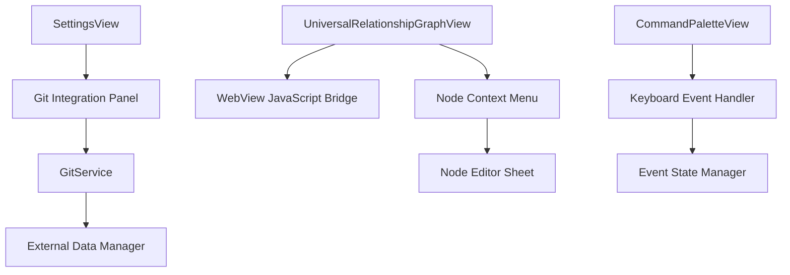

# Design Document

## Overview

This design document outlines the implementation of three key enhancements to the WordTagger application:

1. **Node Context Menu System**: Adding right-click functionality to graph nodes for editing commands and names
2. **Keyboard Shortcut Fix**: Resolving the Command+G/Command+W interference issue in the command palette
3. **Git Integration**: Adding Git repository connectivity to the settings for external data synchronization

The design leverages the existing SwiftUI architecture and extends the current graph interaction patterns while maintaining consistency with the application's design principles.

## Architecture

### Component Overview



### Data Flow

1. **Node Interaction Flow**: User right-clicks → WebView captures event → Swift receives callback → Context menu displays → User selects action → Editor sheet opens
2. **Keyboard Event Flow**: User presses keys → Event handler processes → State manager prevents conflicts → Action executes
3. **Git Integration Flow**: User configures Git → GitService validates → Data syncs → Status updates in UI

## Components and Interfaces

### 1. Node Context Menu System

#### NodeContextMenuView
```swift
struct NodeContextMenuView: View {
    let node: Node
    let onEditCommand: () -> Void
    let onEditName: () -> Void
    let onDelete: () -> Void
    
    var body: some View {
        VStack(alignment: .leading, spacing: 0) {
            Button("Edit Command Label") { onEditCommand() }
            Button("Edit Node Name") { onEditName() }
            Divider()
            Button("Delete Node") { onDelete() }
                .foregroundColor(.red)
        }
    }
}
```

#### NodeEditorSheet
```swift
struct NodeEditorSheet: View {
    @Binding var node: Node
    @State private var editedText: String = ""
    @State private var editedCommand: String = ""
    let onSave: (Node) -> Void
    let onCancel: () -> Void
}
```

#### JavaScript Bridge Extension
Extend the existing WebView message handling to support right-click events:

```javascript
// Add to UniversalRelationshipGraphView HTML
network.on("oncontext", function(params) {
    if (params.nodes.length > 0) {
        const nodeId = params.nodes[0];
        window.webkit.messageHandlers.nodeRightClicked.postMessage({
            nodeId: nodeId,
            x: params.pointer.DOM.x,
            y: params.pointer.DOM.y
        });
    }
});
```

### 2. Keyboard Event State Manager

#### KeyboardEventManager
```swift
class KeyboardEventManager: ObservableObject {
    @Published private var activeCommands: Set<String> = []
    @Published private var commandExecutionState: [String: Date] = [:]
    
    private let commandCooldown: TimeInterval = 0.5
    
    func canExecuteCommand(_ command: String) -> Bool {
        // Prevent rapid re-execution of the same command
        if let lastExecution = commandExecutionState[command] {
            return Date().timeIntervalSince(lastExecution) > commandCooldown
        }
        return true
    }
    
    func markCommandExecuted(_ command: String) {
        commandExecutionState[command] = Date()
        
        // Clean up old entries
        DispatchQueue.main.asyncAfter(deadline: .now() + commandCooldown * 2) {
            self.commandExecutionState.removeValue(forKey: command)
        }
    }
    
    func clearCommandState() {
        activeCommands.removeAll()
        commandExecutionState.removeAll()
    }
}
```

#### Enhanced Command Palette Event Handling
Modify the existing CommandPaletteView to use the KeyboardEventManager:

```swift
// In CommandPaletteView
@StateObject private var keyboardManager = KeyboardEventManager()

.onKeyPress(.init("g"), phases: .down) { keyPress in
    if keyPress.modifiers.contains(.command) {
        guard keyboardManager.canExecuteCommand("command-g") else {
            return .handled
        }
        
        keyboardManager.markCommandExecuted("command-g")
        // Execute Command+G functionality
        handleCommandG()
        return .handled
    }
    return .ignored
}

.onKeyPress(.init("w"), phases: .down) { keyPress in
    if keyPress.modifiers.contains(.command) {
        guard keyboardManager.canExecuteCommand("command-w") else {
            return .handled
        }
        
        keyboardManager.markCommandExecuted("command-w")
        // Clear any pending command states before closing
        keyboardManager.clearCommandState()
        
        // Execute window close
        handleCommandW()
        return .handled
    }
    return .ignored
}
```

### 3. Git Integration System

#### GitService
```swift
class GitService: ObservableObject {
    @Published var connectionStatus: GitConnectionStatus = .disconnected
    @Published var lastSyncDate: Date?
    @Published var pendingChanges: Int = 0
    
    private var repositoryURL: String?
    private var credentials: GitCredentials?
    
    enum GitConnectionStatus {
        case disconnected
        case connecting
        case connected
        case error(String)
    }
    
    struct GitCredentials {
        let username: String
        let token: String // Personal access token
    }
    
    func configureRepository(url: String, credentials: GitCredentials) async throws {
        connectionStatus = .connecting
        
        // Validate repository accessibility
        guard await validateRepository(url: url, credentials: credentials) else {
            connectionStatus = .error("Unable to access repository")
            throw GitError.invalidRepository
        }
        
        self.repositoryURL = url
        self.credentials = credentials
        connectionStatus = .connected
        
        // Save configuration securely
        try saveConfiguration()
    }
    
    func commitChanges(message: String) async throws {
        guard connectionStatus == .connected else {
            throw GitError.notConnected
        }
        
        // Implementation for git commit
        // This would use a Git library or shell commands
    }
    
    func pushToRemote() async throws {
        guard connectionStatus == .connected else {
            throw GitError.notConnected
        }
        
        // Implementation for git push
        // Update lastSyncDate on success
        lastSyncDate = Date()
    }
    
    private func validateRepository(url: String, credentials: GitCredentials) async -> Bool {
        // Implementation to test repository connection
        return true
    }
    
    private func saveConfiguration() throws {
        // Save to Keychain for security
    }
}

enum GitError: Error {
    case invalidRepository
    case notConnected
    case authenticationFailed
    case networkError
}
```

#### Git Settings Panel
Extend the existing SettingsView with a new Git tab:

```swift
// Add to SettingsView TabView
GitSettingsView()
    .tabItem {
        Label("Git", systemImage: "externaldrive.connected.to.line.below")
    }
```

#### GitSettingsView
```swift
struct GitSettingsView: View {
    @StateObject private var gitService = GitService()
    @State private var repositoryURL: String = ""
    @State private var username: String = ""
    @State private var token: String = ""
    @State private var showingCredentialsSheet = false
    
    var body: some View {
        ScrollView {
            VStack(alignment: .leading, spacing: 20) {
                // Connection Status
                GroupBox("Repository Status") {
                    HStack {
                        statusIndicator
                        VStack(alignment: .leading) {
                            Text(statusText)
                                .font(.headline)
                            if let lastSync = gitService.lastSyncDate {
                                Text("Last sync: \(lastSync, style: .relative) ago")
                                    .font(.caption)
                                    .foregroundColor(.secondary)
                            }
                        }
                        Spacer()
                    }
                    .padding(12)
                }
                
                // Repository Configuration
                GroupBox("Repository Configuration") {
                    VStack(alignment: .leading, spacing: 12) {
                        TextField("Repository URL", text: $repositoryURL)
                            .textFieldStyle(.roundedBorder)
                        
                        HStack {
                            Button("Configure Credentials") {
                                showingCredentialsSheet = true
                            }
                            .buttonStyle(.bordered)
                            
                            Spacer()
                            
                            Button("Connect") {
                                Task {
                                    await connectToRepository()
                                }
                            }
                            .buttonStyle(.borderedProminent)
                            .disabled(repositoryURL.isEmpty)
                        }
                    }
                    .padding(12)
                }
                
                // Git Operations
                if gitService.connectionStatus == .connected {
                    GroupBox("Git Operations") {
                        VStack(spacing: 12) {
                            HStack {
                                Text("Pending changes: \(gitService.pendingChanges)")
                                Spacer()
                                Button("Commit Changes") {
                                    Task {
                                        await commitChanges()
                                    }
                                }
                                .buttonStyle(.bordered)
                                .disabled(gitService.pendingChanges == 0)
                            }
                            
                            HStack {
                                Spacer()
                                Button("Push to Remote") {
                                    Task {
                                        await pushChanges()
                                    }
                                }
                                .buttonStyle(.borderedProminent)
                            }
                        }
                        .padding(12)
                    }
                }
            }
            .padding()
        }
        .sheet(isPresented: $showingCredentialsSheet) {
            GitCredentialsSheet(
                username: $username,
                token: $token,
                onSave: { /* Save credentials */ }
            )
        }
    }
    
    private var statusIndicator: some View {
        Circle()
            .fill(statusColor)
            .frame(width: 12, height: 12)
    }
    
    private var statusColor: Color {
        switch gitService.connectionStatus {
        case .connected: return .green
        case .connecting: return .orange
        case .error: return .red
        case .disconnected: return .gray
        }
    }
    
    private var statusText: String {
        switch gitService.connectionStatus {
        case .connected: return "Connected"
        case .connecting: return "Connecting..."
        case .error(let message): return "Error: \(message)"
        case .disconnected: return "Not connected"
        }
    }
}
```

## Data Models

### Node Command Extension
Extend the existing Node model to support command storage:

```swift
extension Node {
    var commandLabel: String? {
        get {
            // Retrieve from markdown or dedicated field
            return extractCommandFromMarkdown()
        }
        set {
            // Store in markdown or dedicated field
            updateCommandInMarkdown(newValue)
        }
    }
    
    private func extractCommandFromMarkdown() -> String? {
        // Parse markdown for command information
        return nil
    }
    
    private func updateCommandInMarkdown(_ command: String?) {
        // Update markdown with command information
    }
}
```

### Git Configuration Model
```swift
struct GitConfiguration: Codable {
    let repositoryURL: String
    let username: String
    let lastSyncDate: Date?
    let autoSync: Bool
    
    // Note: Token stored separately in Keychain for security
}
```

## Error Handling

### Node Context Menu Errors
- **Node Not Found**: Display alert and refresh graph data
- **Edit Conflicts**: Show merge dialog for concurrent edits
- **Save Failures**: Retry mechanism with user notification

### Keyboard Event Errors
- **Event Conflicts**: Use KeyboardEventManager to prevent overlapping commands
- **State Corruption**: Automatic state reset after timeout
- **Focus Issues**: Explicit focus management in event handlers

### Git Integration Errors
- **Network Failures**: Retry with exponential backoff
- **Authentication Errors**: Prompt for credential refresh
- **Merge Conflicts**: Present conflict resolution interface
- **Repository Access**: Validate permissions and provide helpful error messages

## Testing Strategy

### Unit Tests
1. **KeyboardEventManager**: Test command cooldown and state management
2. **GitService**: Mock repository operations and test error scenarios
3. **Node Context Menu**: Test menu generation and action handling

### Integration Tests
1. **Graph Interaction**: Test right-click → context menu → editor flow
2. **Keyboard Events**: Test Command+G/Command+W sequence handling
3. **Git Operations**: Test full commit/push workflow with mock repository

### UI Tests
1. **Context Menu Display**: Verify menu appears at correct position
2. **Settings Navigation**: Test Git settings tab functionality
3. **Error States**: Verify error messages display correctly

### Manual Testing Scenarios
1. **Node Editing Workflow**: Right-click node → edit command → save → verify persistence
2. **Keyboard Shortcut Sequence**: Command+G → Command+W → verify no double execution
3. **Git Integration**: Configure repository → commit changes → push → verify sync status

## Performance Considerations

### Node Context Menu
- **Lazy Loading**: Only create context menu when needed
- **Memory Management**: Properly dispose of editor sheets
- **Event Debouncing**: Prevent rapid-fire context menu requests

### Keyboard Events
- **Event Filtering**: Only process relevant key combinations
- **State Cleanup**: Automatic cleanup of expired command states
- **Memory Efficiency**: Minimal state storage in KeyboardEventManager

### Git Operations
- **Background Processing**: Perform Git operations off main thread
- **Progress Indication**: Show progress for long-running operations
- **Caching**: Cache repository status to reduce network calls

## Security Considerations

### Git Credentials
- **Keychain Storage**: Store tokens in macOS Keychain
- **Token Validation**: Verify token permissions before use
- **Secure Transmission**: Use HTTPS for all Git operations

### Node Data Protection
- **Input Validation**: Sanitize user input in node editor
- **Access Control**: Verify user permissions for node modifications
- **Data Integrity**: Validate node data before saving

This design provides a comprehensive foundation for implementing the three requested features while maintaining the existing application architecture and ensuring robust error handling and security.