# Connection 真实架构图

## 🏗️ 核心架构

```mermaid
graph TB
    subgraph "应用入口"
        WordTaggerApp["WordTaggerApp.swift<br/>• 应用主入口<br/>• TagMappingManager 内嵌<br/>• smartTokenize 智能分词"]
    end

    subgraph "核心数据层"
        Store["Store.swift (NodeStore)<br/>• 3066行核心代码<br/>• 中央数据管理<br/>• @Published 响应式属性"]
        Models["Models.swift<br/>• Node/Layer/Tag 定义<br/>• isCompound 计算属性"]
    end

    subgraph "持久化服务"
        ExternalDataService["ExternalDataService.swift<br/>• JSON 数据保存/加载<br/>• 异步文件操作"]
        ExternalDataManager["ExternalDataManager.swift<br/>• 路径管理<br/>• 权限控制"]
        GitService["GitService.swift<br/>• Git 自动同步<br/>• 凭据管理"]
    end

    subgraph "业务服务"
        SearchService["SearchService.swift<br/>• 模糊搜索<br/>• 多字段匹配"]
        GraphService["GraphService.swift<br/>• 节点关系分析<br/>• 图谱数据生成"]
        GeocoderService["Geocoder.swift<br/>• 地理位置解析<br/>• 坐标转换"]
    end

    subgraph "窗口管理"
        WindowFocusManager["WindowFocusManager.swift<br/>• 多窗口协调<br/>• 竞态条件防护"]
        TagGraphWindowManager["TagGraphWindowManager.swift<br/>• 标签图谱窗口"]
        KeyboardEventManager["KeyboardEventManager.swift<br/>• 键盘事件处理<br/>• 错误恢复"]
    end

    subgraph "UI 组件"
        ContentView["ContentView.swift<br/>• 主界面布局"]
        DetailPanel["DetailPanel.swift<br/>• 节点编辑面板<br/>• Markdown 支持"]
        MapContainer["MapContainer.swift<br/>• 地图可视化<br/>• 位置标记"]
        CommandPaletteView["CommandPaletteView.swift<br/>• 命令面板<br/>• 快捷操作"]
        SettingsView["SettingsView.swift<br/>• 设置界面<br/>• Git 配置"]
    end

    subgraph "追踪系统 (可选)"
        TracingService["TracingInfrastructure.swift<br/>• TracingService 类<br/>• 分布式追踪"]
        ObservabilityDashboard["ObservabilityDashboard.swift<br/>• 监控面板"]
    end

    %% 核心数据流
    WordTaggerApp --> Store
    Store --> Models
    Store --> ExternalDataService
    ExternalDataService --> ExternalDataManager
    Store --> GitService

    %% UI 到数据的连接
    ContentView --> Store
    DetailPanel --> Store
    MapContainer --> Store
    CommandPaletteView --> Store
    SettingsView --> Store

    %% 服务依赖
    Store --> SearchService
    Store --> GraphService
    MapContainer --> GeocoderService

    %% 窗口管理
    ContentView --> WindowFocusManager
    ContentView --> KeyboardEventManager
    WindowFocusManager --> TagGraphWindowManager

    %% 可选追踪
    Store -.-> TracingService
    TracingService -.-> ObservabilityDashboard

    classDef core fill:#e3f2fd,stroke:#1976d2,stroke-width:3px
    classDef service fill:#f3e5f5,stroke:#7b1fa2,stroke-width:2px
    classDef ui fill:#fff8e1,stroke:#f57c00,stroke-width:2px
    classDef tracing fill:#e8f5e8,stroke:#388e3c,stroke-width:2px

    class WordTaggerApp,Store,Models core
    class ExternalDataService,ExternalDataManager,GitService,SearchService,GraphService,GeocoderService,WindowFocusManager,TagGraphWindowManager,KeyboardEventManager service
    class ContentView,DetailPanel,MapContainer,CommandPaletteView,SettingsView ui
    class TracingService,ObservabilityDashboard tracing
```

## 🔍 真实文件统计

- **总 Swift 文件**: 74个
- **核心服务**: 约15个实际类
- **主要 UI 组件**: 约20个 SwiftUI View
- **数据模型**: 集中在 Models.swift

## 💡 关键设计

### 单一数据源模式
所有状态集中在 `Store.swift` (NodeStore)，通过 @Published 属性驱动 UI 更新。

### 多窗口协调
通过 `WindowFocusManager` 和 `NotificationCenter` 协调多窗口操作。

### 异步数据持久化
`ExternalDataService` 负责所有文件 I/O，`GitService` 处理版本控制。