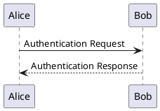
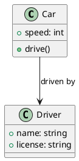
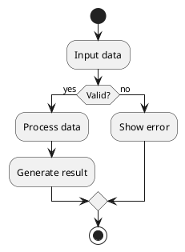
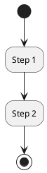

# PlantUML 居中测试

## 测试1: 基本时序图

```plantuml
@startuml
Alice -> Bob: Authentication Request
Bob --> Alice: Authentication Response
@enduml
```

## 测试2: 类图

```plantuml
@startuml
class Car {
  +speed: int
  +drive()
}
class Driver {
  +name: string
  +license: string
}
Car --> Driver : driven by
@enduml
```

## 测试3: 活动图

```plantuml
@startuml
start
:Input data;
if (Valid?) then (yes)
  :Process data;
  :Generate result;
else (no)
  :Show error;
endif
stop
@enduml
```

## 测试4: 简单流程图

```plantuml
@startuml
(*) --> "Step 1"
"Step 1" --> "Step 2"
"Step 2" --> (*)
@enduml
```

这些PlantUML图表应该在所有编辑模式下都居中显示。